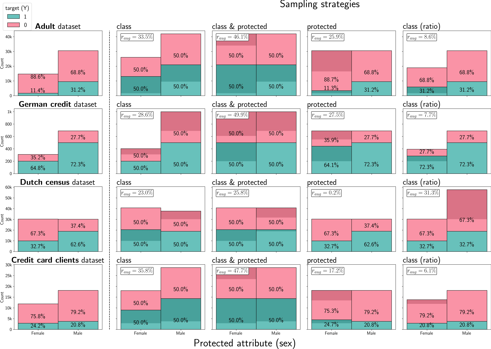

Official code for our paper titled:

**Synthetic Tabular Data Generation for Class Imbalance and Fairness: A Comparative Study**

accepted at the 4th Workshop on Bias and Fairness in AI, <u> ECML PKDD 2024</u>, 13th of September, Vilnius (Lithuania) 

---

This paper conducts a comparative analysis to address class and group imbalances using state-of-the-art models for synthetic tabular data generation and various sampling strategies.

---

  
   
  <em>Figure 1: Distributions of class and group imbalance for each real dataset (first column) along with final augmented dataset for each sampling strategy.</em>

